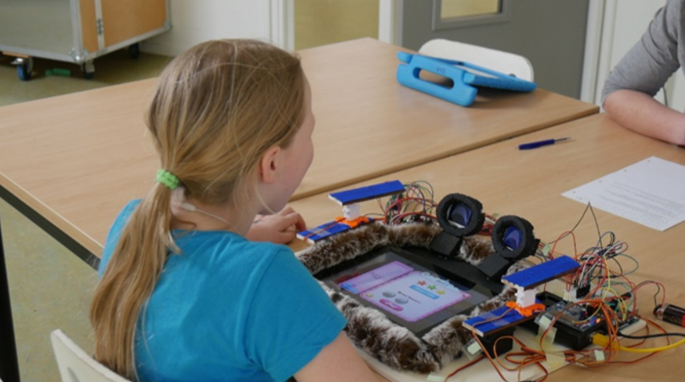

## Method

From scientific papers, we learnt that children of 5-7 years old have great affinity with toys and are fond of animals at this age: thus followed the idea to create an animal-like screen case. To determine the look, feel and behaviour of the case, we used multiple design methods such as **paper** and **cardboard prototyping**, **acting out**, **interviewing** and **co-designing**. We interviewed and had co-design sessions with 5-7 year olds, which was incredibly fun.

Children have opinions but do not always know how to express them. We took this into account by using an adjusted **smiley-o-meter** (with thumbs up and down). Small tricks like this helped the children feel more confident in their answers.

Furthermore, we asked children to portray various emotions by themselves and mimic these emotions on a cardboard prototype that we created. We performed these playtests to figure out if and how we should continue with our case build. An example of a surprising result was the way the children acted out the emotion sleepiness. We expected them to rub their eyes. However, they expressed sleepiness by hanging their head in their hands, and so we learnt from that and changed the robot's expressions and movements accordingly.

The final shape of the robot is a crossover between a teddy-bear and a frog-like appearance, with the fur fabric, which was most preferred. Using actuators and LCD's, we **programmed** sleepy, happy, angry and neutral behaviours for the robot.

## Conclusion and future plans

We tested out the **low-fi prototype** to see if children understood the robot's intentions/emotions while they were playing a game. The robot would be happy/neutral at first, become sleepy after the child played for too long and angry if the child didn't stop playing.

They attributed quite a lot of power to the robot, indicating that they would listen to it if it told them to stop and they could see it as being **a friend** of theirs. This finding is in line with other robot-research, that shows that children can quickly bond with robots.
