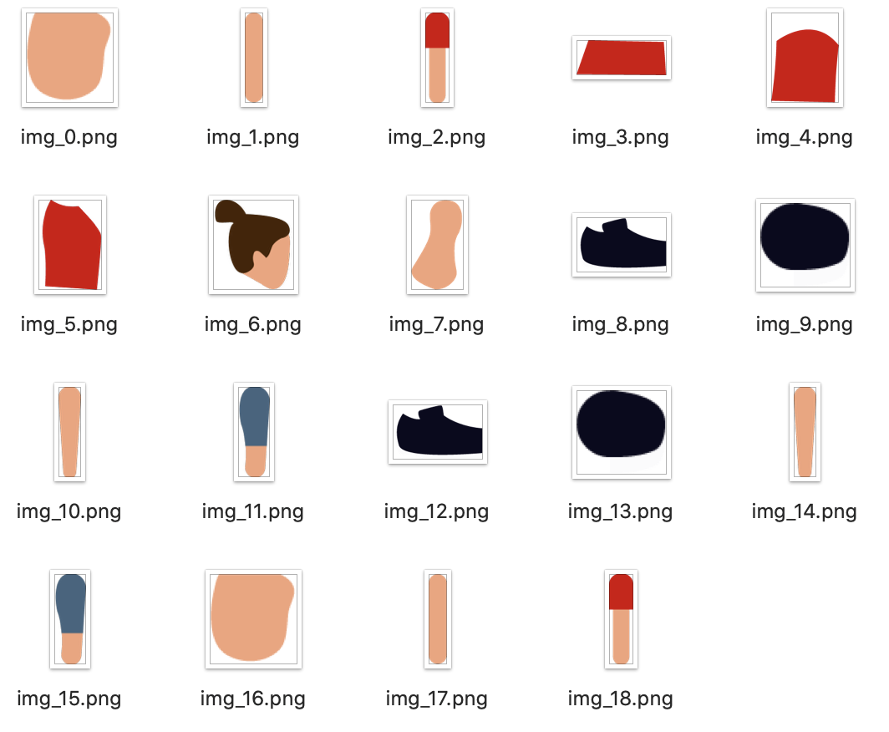

## Method

My biggest challenge concerning animation to date was creating explanatory animations for working out. I cannot write down too many details due to sensitive company information, but I was assigned to find out whether it was possible to create animations instead for working out. One of the pro's of using animation would be that it would not introduce inconsistencies such as video can, when the environment/lights/other factors differ.

I needed to create a skeleton of different body parts in separated layers in Adobe After Illustration, import this into Adobe After Effects and link all parts to the proper skeleton parts using this plugin. The different body parts could then be manipulated to move in a human-like manner using the plugin Bodymovin. Extremely interesting and fun to work with! After creating some movements, I used the Lottie plugin by AirBnB to create a JSON file (a very low in kB, text-based file) to import the animation into Android Studio, to be able to use it in the app. It took some trial and error and more plugins to get to the proper JSON file that could be understood by Android Studio, but I managed to get it to work! This felt like a huge victory, knowing that we could create these types of animations ourselves.

## Conclusion and future plans

I've created several small animations, such as loaders, that are included in apps of MoveLab Studio. Other work has been done just for fun, such as some animations that can be found on this website. I would love to do more animation work than I am doing currently! I really enjoy seeing work from different applications (Illustrator, After Effects, etc) and plugins come together to create a moving element in an app or website, that elevates an user experience.
