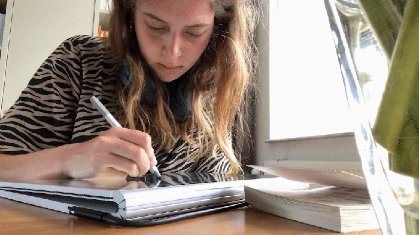

## Method

A birthday calendar is a typical Dutch thing. It's a place where we note down all the birthdays of important people in our lives, in order not to forget them. Usually a calendar like this is found on people's toilets, but anywhere else is perfectly fine too.

The idea to use different birthday traditions seemed fun to me, so the calendar would be relatable to all Dutch people and could teach non-Dutchies who happen to visit the toilet a thing or two about our culture.

I used Adobe Fresco to draw all the images, and Adobe Illustrator to create the full calendar layout. I went through many iterations before I found the style I wanted to apply throughout the whole calendar. I made sure to work with a colour palette so the calendar would be cohesive. Besides that, little Easter eggs can be found in the calendar, where objects and people from different months are found back in other months.

## Conclusion and future plans

I've contacted HEMA whether they would consider adding this calendar to their inventory. I was very happy to hear that they loved the style of the calendar and believed it would fit their brand. Unfortunately, it turned out that HEMA works with in-house designers and outside contracts. It is not very easy for an independent creator to get their product into a store. However, I plan to put the calendar up for sale on Etsy and message other brands in the future!
