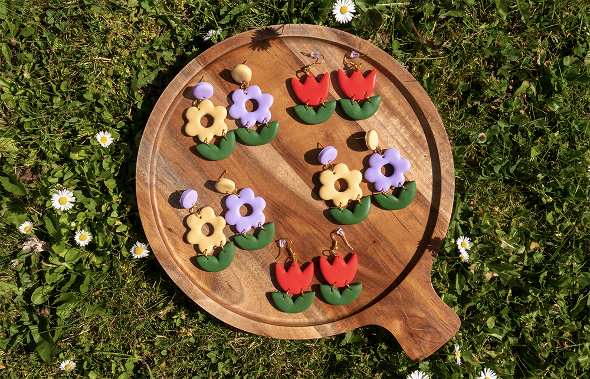

## Method

When I started to make earrings, it was mostly because I found the ones on Instagram too pricy. They'd have to be flown in from the USA, Hawaii or Australia which added on massive extra costs. So I gave it a try! And I wanted to give it a good try. Which meant polishing my **3D modelling skills**, **3D printing** the designs at home, conditioning the clay, cleaning and polishing it at the end and putting them together to create the final result.

## Conclusion and future plans

I plan to create a few more mini collection of earrings, although it does not have a priority right now. It brings me a lot of joy, but is a time consuming process next to a full time job.
