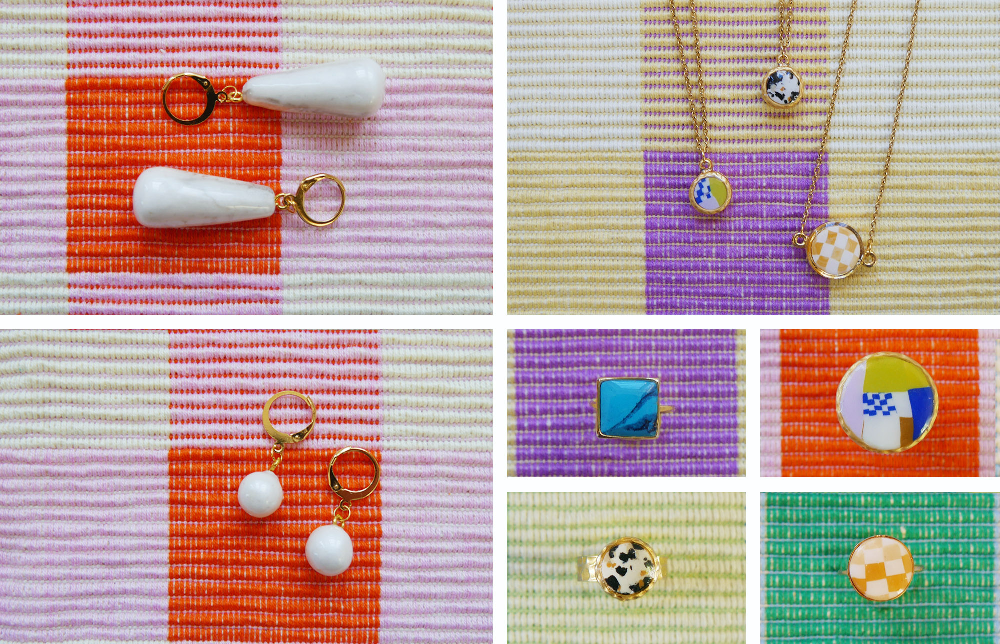

## Method

What I love about clay is that it allows you to literally create anything. I started by just making earrings, but I've learnt to go beyond that. For example, I've been experimenting with inlays, which means embedding the clay in ring or necklace structures. It's extremely fun to make a little set of jewelry that all fits together in terms of colours and style. Furthermore, one of my favourite things I've discovered is resin. The shine of the epoxy really takes the earrings to the next level.

Feel free to check out my earlier earrings, amongst which a little promo video of a mini collection and some behind the scenes 3D-printing, by clicking [here](http://www.nynkezwart.com/projects/clay-earrings)!

I'm also looking into commissions and another mini collection in the future. It's something I would love to do.
