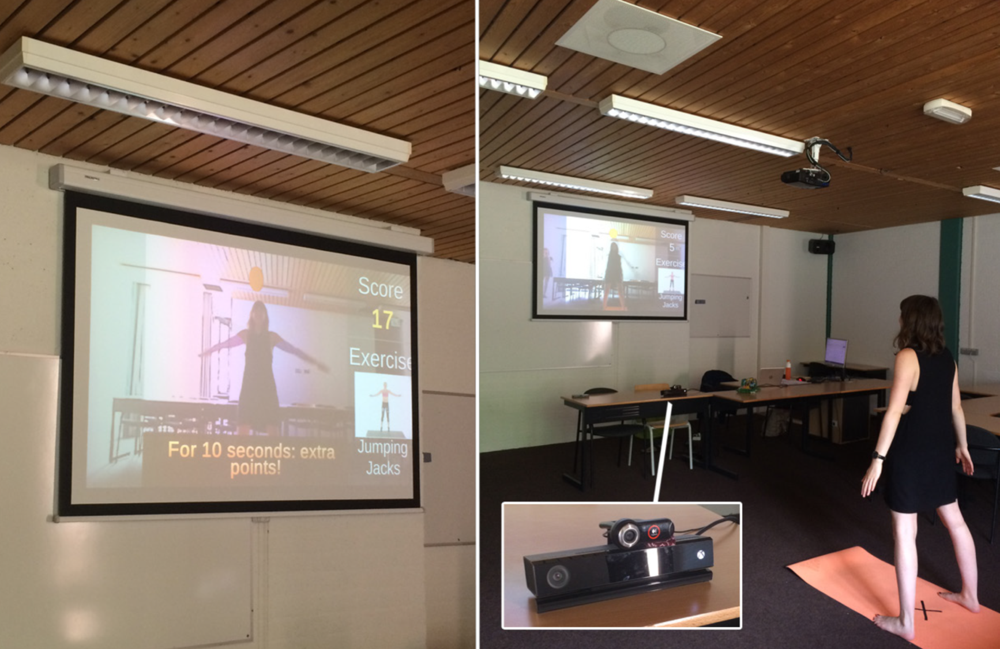

## Method

While many games related to sports exist, the AR approach hasn't been used often. I wanted to research whether the AR application that I created could heighten the motivation of users, amongst other factors. I studied multiple gamification approaches, such as BLAP gamification, meaningful gamification, Game Flow and Self Determination theory. I used these theories to shape my application, which was created using Unity (building software), Vuforia (AR plugin) and a Kinect (for detecting and following a user's skeleton).

I created two versions of the application: a baseline exercise program (BEP) and a gamified exercise program (GEP). The gamified program was enhanced with collecting coins during movements and getting score boosts at certain points, amongst other things. The programs were both tested out by randomly assigned participant groups (N=20 for each group). In both groups, participants would have to perform a pre-determined set of exercises. They didn't know how many exercises there were in total. They were also in full control over when they wanted to go to the next exercise, by using the voice command ''next''. Saying ''stop'' stopped the program completely. User's were free in stopping whenever they wanted. The total time of doing sports was recorded by the researcher. The participants also had to fill in multiple questionnaires, on sports motivation, sports emotion and game flow criteria.

## Conclusion and future plans

The results showed that scores on game flow and the duration of the workout were significantly higher for the gamified exercise program group. Difference in mood/emotion turned out not to be significant between the two groups. Additional research on the effects of being intrinsically or extrinsically motivated could unfortunately not be researched, because of skewed distributions (only 5 out of 40 participants were extrinsically motivated).

In the end, I feel proud of this thesis because I had complete ownership over everything, from creating the game to collecting participants to analysing the results. It was challenging to learn new skills all by myself and accomplishing that felt great!
