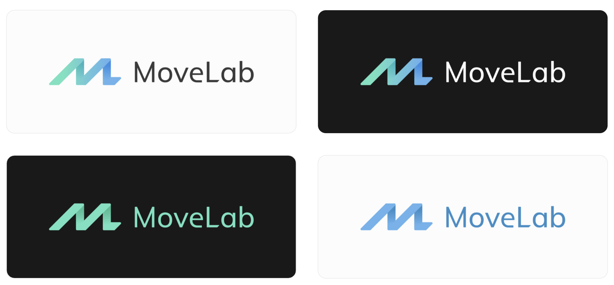

## Method

The logo for MoveLab Studio (shortened: MoveLab) needed to convey several things: a trustworthy brand, a young brand, a professional brand. The logo also needed to hint to the name itself, as the company creates digital products for fitness machines. A certain notion of movement thus needed to be contained within the logo.

I read the book Logo Design Love: A Guide to Creating Iconic Brand Identities by David Airey as a guideline for the process of working on logos. It taught me many things, such as interviewing important people at the company, creating association word webs to describe the company and beyond (be creative!), starting to design in B&W before adding colour, how to present your ideas... etcetera. His advice made me follow a structured path.

Mostly, the creation of this logo taught me that iteration is key: a lot of logos were tried out, iterated upon and discarded. It also taught me that prejudices on what a logo ''should look like'' for a certain type of company, do not necessarily always work. For example, I took the approach of big bold, caps lock letters to begin with. I thought that that was what represented movement well.

In the end it turned out that a combination of upper and lower case fitted MoveLab better, it did not need to be as ''loud''. This is because MoveLab's products support other companies products instead of trying to sell something on their own. Furthermore, the movement is still captured by the portrayal of the ''M'', with it's 45 degree skew.

A lot of colour palettes were tried out before settling with a young, fresh, bright green colour and trustworthy blue. These colours also proved to be very flexible in terms of dark and light modes, creating gradients, readability, and so on.

The font that we decided, Mulish, was also slightly modified to fit in with the ''M''. We added little details such as a 45 degree cut on the bottom of the ''L'', and a little change of the ''e'' to give it a longer bottom, flat on the ''ground'' instead of curving back up. We went into a lot more detail than most people would even recognize in the logo at a first glance.

## Conclusion and future plans

And last but not least, a crucial part of the process is convincing people of your vision. My colleague and I needed to convince both of our bosses of our design. We did experience what was written in the design book, namely that non-designers can start giving their own input and expect you to try out their suggestions, even when you know they won't work. Therefore, it's important to recognise that you need to convince people that they should trust you, as you are the designer.

In our last presentation of the final designs, we presented confidently, stood our ground, believed in our vision and it paid off. Our bosses were very happy with the final product and in the meanwhile we have added the logo everywhere, including an awesome neon sign on our office wall.

‍
