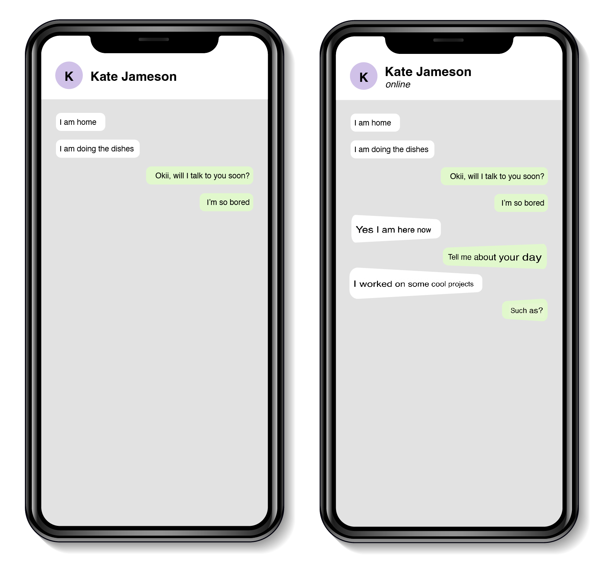

## Method

With social media ever present, many of our daily conversations are held via text messaging services. However, the interactions are said to be lacking in ''richness''. Through **ethnographic research** on social and mobile interactions (both interviews and videos), I identified **attentiveness, timing and expressiveness** as important non-verbal behaviour sets.

I used components from these sets - such as forward leaning and facial animation - to create new concepts for text messaging GUI's, that **leverage our body knowledge**. Text boxes take on new meanings by posing as users' own bodies.

The proposed design ideas support **participatory sensemaking** by making control and coordination of movements of the text boxes possible.

My ideas propose **a new perspective** on the use of **embodiment** by keeping representations compact and avoiding the addition of extra physical components, which often happens in the field of Embodied Interaction. There was insufficient time during the course project to fully test users' understanding of all the different concepts.

