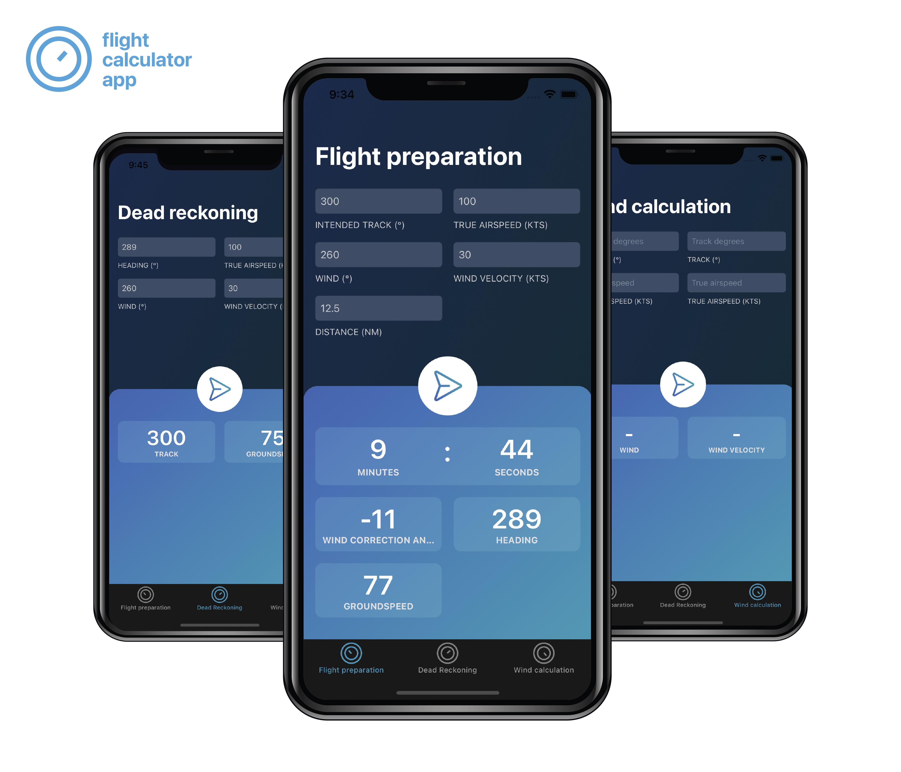

## Method

This app was great to create as it allowed me to learn by doing, with a specified goal. I started with creating the designs for the app. I then set up a GitHub repository as I wanted to do this the ‘’proper way’’, documenting it and saving it online. After that I implemented all the calculations (three types: Wind Calculation / Dead Reckoning / Flight Preparation) and wrote tests for them to make sure they were correct and could handle edge cases. With this done, I started implementing the designs. I had to make sure that the right keyboards would be shown for a user to give their input and that their input could be handled (i.e. comma’s, points, and so on). Last but not least, it was time to use the user’s input to calculate results and create a working button so that the output could be displayed. It was a super fun project. I have not put it in the app store because of fees and those kinds of things, but it taught me a great deal and I enjoyed dipping my toes into Xcode.

