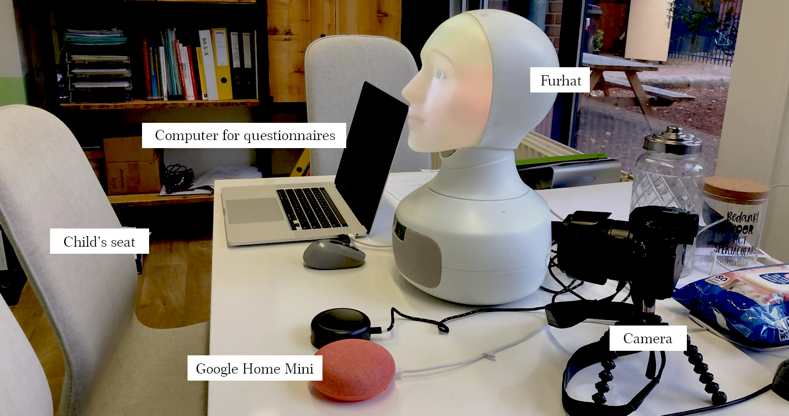

## Method

Young children are prone to create strong bonds with robots and are very trusting of companies up until the age of 12. They give out a lot of information about themselves, even though they seem privacy aware.

In research papers, it became clear that the embodiment of a robot can facilitate higher levels of information disclosure, which creates serious privacy concerns as no regulations exist on this. Furthermore, not much research about this phenomenon has been done in relation to children, even though children are in contact with robots from a very young age and create strong bonds with them: this can make them more vulnerable to disclose information.

These gaps in knowledge led to the experimental study (a 2x2 between-subject design) of my master thesis in which 79 primary school children, aged 8-12 years old, conversed with an embodied conversational agent for five minutes. I programmed these embodied agents to be able to converse with children.

The agent was either a Furhat robot or a Google Home Mini device. At several points in the conversation, the robot requested personal information in the form of a privacy permission request. Children's compliance on this determined an information disclosure score and their understanding of the content of the request determined a privacy awareness score. Besides the different levels of agent embodiment, a ‘’stranger presence’’ within the agent could occur during a request. For the Furhat, this meant a change in voice and face, for the Google Home Mini a change in voice only. The stranger symbolised the company behind each service, as the people behind a company are often strangers to its users. All project materials such as videos of these ‘’stranger’’ changes can be found here: [https://sites.google.com/view/master-thesis-nynke-zwart/](https://sites.google.com/view/master-thesis-nynke-zwart/).

Next to this, children are taught about not complying to strangers from a young age and they indicate that they seek privacy from strangers online as well. This novel approach of a stranger presence might therefore trigger their knowledge on stranger danger and lower their information disclosure.

## Conclusion and future plans

The results show that the level of agent embodiment and presence or absence of a stranger did not lead to significant differences in information disclosure and privacy awareness. It seemed that children’s personal background and preferences played a huge role in how they responded to the robots and the possible ‘’stranger appearance’’. The study also made clear that a higher age does not automatically mean that children are more knowledge about safe handling of personal information: there were children of 8 years old who were more careful than 12 year olds and vice versa. As for personal preferences, some children found the Furhat robot scary by default, others found it fascinating and even saw it as a possible friend, disclosing quite personal information (for example about being bullied or medically diagnosed) to it.

This research has uncovered that creating a suitable approach to lower information disclosure and heighten privacy awareness with embodied conversational agents is challenging. This is because of the many factors that may play a role in children's decision-making, such as their background knowledge on privacy risks/strategies and stranger danger, which were not controlled for in this research. This makes the researched topics even more interesting to pursue in detail in future research, to get a better understanding of children's conceptual models and actions. This research paves the way for future studies that will further fill the gap on embodiment and information disclosure/privacy awareness studies in the field of Child-Robot Interaction.
