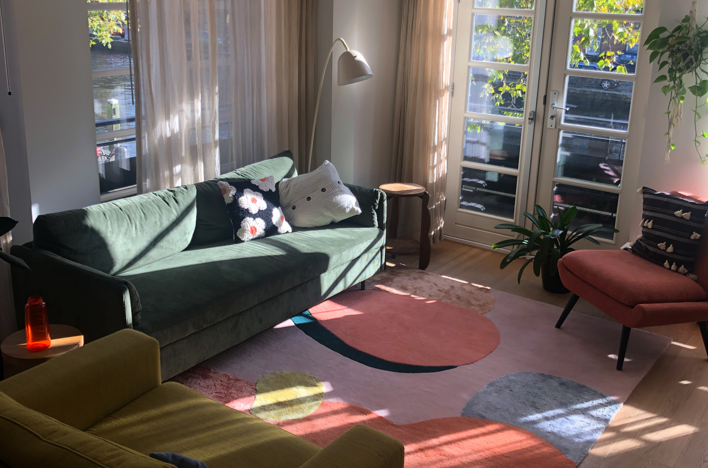

## Method

Since the kitchen is the part of the living room that receives the least natural light, I wanted to make the space feel more bright. The bones of the kitchen were all great, so I kept all the cabinets on the bottom part of the kitchen and replaced all fronts with a more modern, matte white and wooden black handles. The shiny black top cabinets didn't provide a lot of space, so I replaced them with higher, white cabinets. I decided to place three of those, so that I would have space to hang two wooden wall shelves that would go around the corner. I wanted the open shelving so I could display some of my favourite kitchen items. Later, I decided to install three growing lights. During the spring and summer months, I started growing my own herbs and vegetables and the top wooden shelf provides the perfect space to grow those!

The last big decision I needed to take was which new tiles I wanted to install. I first went through many neutral options before I set my eyes on a colour: either green or blue. I loved the blue shade but I had the feeling it would add another big accent colour to my space, which is already quite colourful. So, I opted for green, which matches nicely with my couch and plants. It is a matte, square tile that gives some depth due to its texture/material. To me, it gives a very luxurious feel!

## Conclusion and future plans

A project like this never comes without some struggles. For example, one of the front doors for the cabinets was in the wrong style, the wooden shelves were too short at first (a manufacturer's fault), the putty to put the tiles on top didn't dry fast enough so the tiler had to come back, the tile store didn't calculate enough tiles so we missed 3 of them and needed a quick trip to the store on the tiling day itself... I believe the project taught me to keep my patience, communicate clearly with professionals (kitchen installer, tiler, tile store professionals) and hold on to my vision. But I can only imagine what a big kitchen renovation could be like... I think I only scratched the surface!
