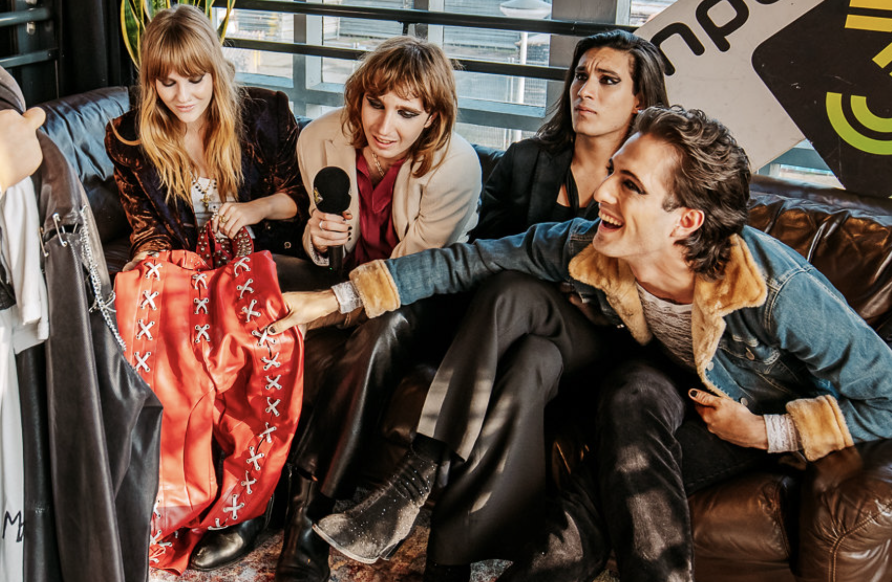

## Method

Once you start sewing, you'll start shopping differently... I catch myself in stores trying on an item, taking some pictures and then make the item at home with the modifications and fabrics that I like. And once you start sewing, you will see that you can literally try to make anything: from pillow cases to toiletry bags, to laptop covers and so on. Improving your skills is the most rewarding part of this hobby and the fact that there is always something to improve or learn.

The craziest part of my sewing journey happened in October 2021. In the beginning of the year, the Italian rock-group Måneskin won the Eurovision Song Contest. I absolutely loved the band once I saw them and bought the earrings that the lead singer Damiano David wore during the performance. A friend then suggested to me that I should try to make his outfit from that performance, to match the earrings. Once that idea was planted, I couldn't let it go. I started googling, trying to find the perfect matching studs for the leather bands, the (fake!) leather fabric, the silver laces, the sailing rings. A month later, I had completed the outfit.

A few months later, Dutch radio station 3FM announced that they were hosting a fashion challenge, to **win tickets** to an exclusive (50 person) concert of Måneskin in Amsterdam. The requirements: it needs to fit in with the style of the band. With my outfit completely ready, I of course went ahead and submitted it! And! I won! Together with two other winners we didn't only get to go to the mega exclusive (amazing!) concert, we were also interviewed on our outfits and the outfits were shown to the band members themselves!
