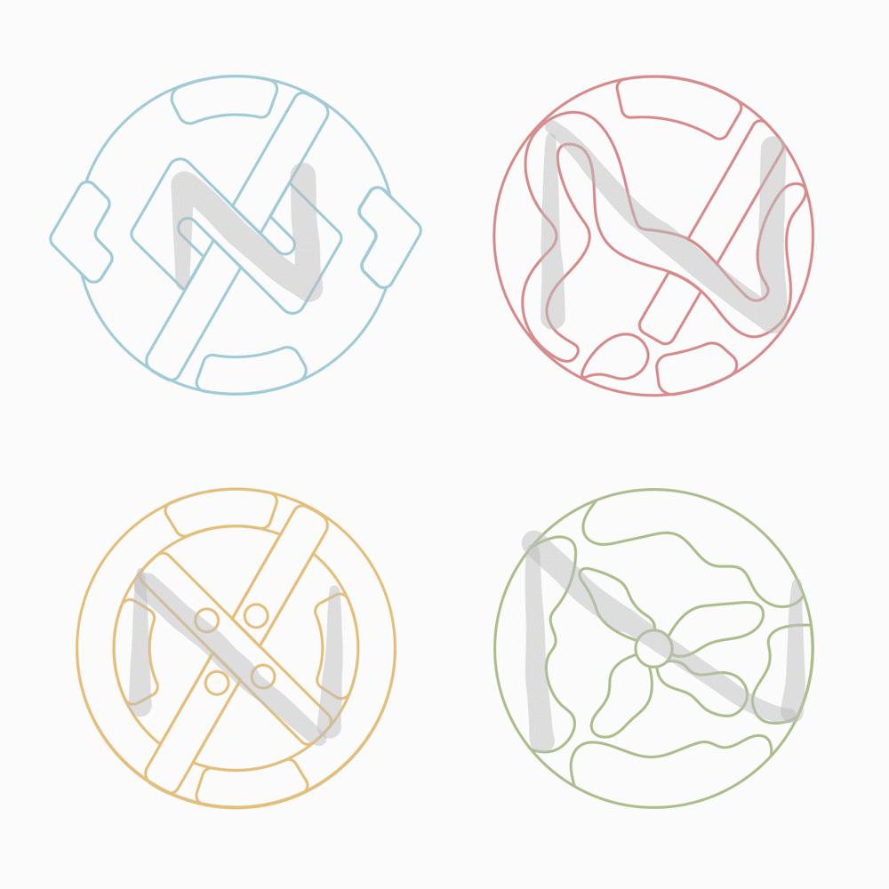

## Method

Nowadays, many logos consist of a written out name in a simple, clear font. After thinking and sketching, I knew that this wasn't what I wanted for my logos. I wanted them to be more free, more creative and moreover, reflect what I do and like. Quickly, I found the categories I wanted to create different logos for: programming and design, both part of my professional career and maker and florist, which are more part of my personal life. I wanted each logo to contain elements (such as shapes and colours) that corresponded to this category. The programming logo was coupled with blue, as many technical companies have blue in their logos. It also contains less organic shapes than other logos, as programming is about following rules and logic. Lastly, it contains the classical brackets that we all know belong to programming (although in reality we use these brackets less and less). The same line of reasoning was applied to the other logos as well.

I knew I needed a way to make these logos feel different and yet part of a whole (me!), so I came up with the idea to encapsulate them in the shape of a circle. Most avatars on web are encapsulated in a circle, hence this idea. Furthermore, to create even more unity and a nice easter egg, I hid my initials (N Z) in each logo. The N can be read from left to right, the Z from top to bottom. Try to spot them!

The fun thing about the logo structure I have created is that I can create new logos for new categories and in this way I allow myself to be flexible and not stuck to a certain persona. In the end, we are all what we think of ourselves to be and I think that we shouldn't limit ourselves to a few categories.

## Conclusion and future plans

To wrap this text up, remember that I said that I didn't have just 1 logo? I guess that was a bit of a lie. I did create one logo that contains 4 bubbles with my chosen colours: you could see it as a wink to the more detailed logos. You can find it in the navigation bar.
