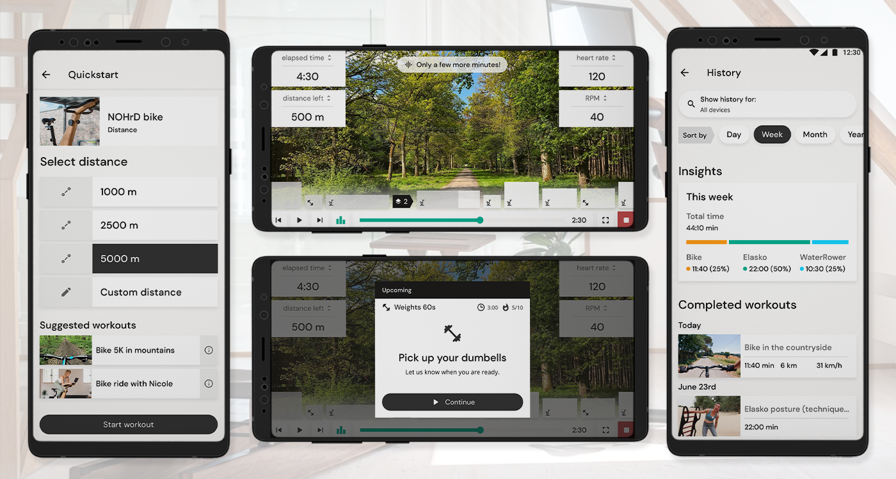

## Method

To the left, a video can be seen of the NOHrD app welcome screen that I designed and edited the video for, which was a combination of several promotional videos of NOHrD. This screen is shown upon opening the application. One of the big design changes that I pushed for while working on the app designs, was to align our app design to the branding of NOHrD. Initially, the application was very dark, while NOHrD exudes brightness and cleanness. After bringing this up with my boss and our partners at NOHrD, a green light was given to go ahead with a redesign of the application. I’m very happy that we took this jump! After the go-sign, me and my design colleague at the time went ahead and created a new design system for the app, really taking the NOHrD brand in consideration by studying their marketing folders, website and opinions of the designers of the NOHrD team.

In its early stages, the NOHrD app only supported one device, the Elasko (a stretching device). The app only contained video workouts. In the future, the idea is to be able to create and choose your own personalized workouts. This will go beyond just video content, to give the user more flexibility in doing exactly what he or she wants. For example, you might have your own rowing or biking goals that you want to achieve. Or maybe you want to train using both these devices, when they are in a gym together or you own them yourself. The app should be able to support these user goals. While designing, we explored the possibilities of a new dashboard (see above for a comparison shot). The dashboard has the new NOHrD design: it also contains many more explorative possibilities, as well as analyses on your workout history. Another screen that was also worked on a lot was the session screen: in other words, what the user would see during a workout. Especially for a workout with multiple devices and multiple workout parts, this would need to be made clear for a user. We decided that timelines would be an interesting concept for this. We also wanted to give the user flexibility, so that they could change the screen to show or hide these timelines. Next to that, they would have options to choose what kind of data they wanted to see on the screen (i.e. heart rate, speed, power, anything that could be relevant to that device). Furthermore, different machines offer different possibilities for visualisations: video, graphs, data fields, etcetera. All possibilities have not been fully explored yet, but we made a proper start to it, some of which can be seen in the screenshots above.

## Conclusion and future plans

These designs are not by any means finalized, so they are not meant to be read as a final truth: design is ever fluid and this project will be worked on for many years to come. Personally, I worked on it for half a year before I decided to leave the company. I’m proud of the work we managed to do thus far and I’m definitely keeping an eye out for all the future design implementations.
