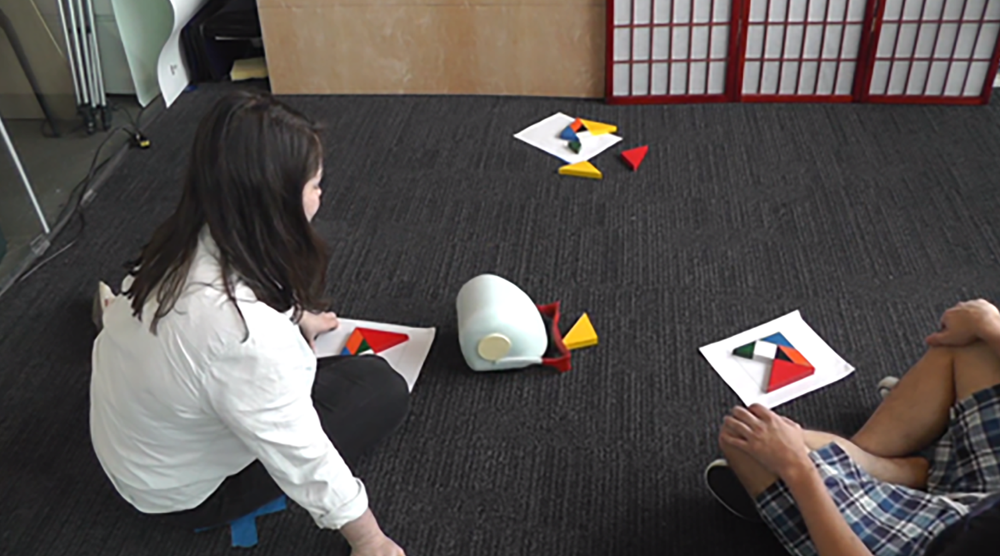

## Method

Cristina and I went to a primary school in the Netherlands for two to three days per week. Each experiment took around 45 minutes and we tested around 60 children. Cristina's research objective was to find out whether playful robots could create and/or benefit positive group dynamics. The main task of a pair of children was to complete a Tangram puzzle, each on their own. The robot would also have its own puzzle to complete. The children needed to take blocks in a specific order while creating the puzzle task and would find out towards the end that they were missing a block. This meant that one child could not finish his/her puzzle. I observed many behaviours that the children exhibited: some children simply took the leftover block, not caring about the other child. Some would take this, others would try to steal it from the other child. Other pairs of children didn't want to take the leftover block, keeping it a fair game.

Depending on the condition, the robot brings the same piece as the leftover block to the children (completion is possible for both children) or takes away the leftover block (meaning that none of the children could finish the puzzle). The reactions of the children on perceived socialness/helpfulness of the robot were determined using a sticker ''give away'' task and questionnaires.

## Conclusion and future plans

Cristina was great in assisting me and giving advice on conducting research. The experience was very valuable. I really enjoyed how varied children's responses were, more so than I expected. Perhaps this reflects how inside-the-box grown-ups often think.
