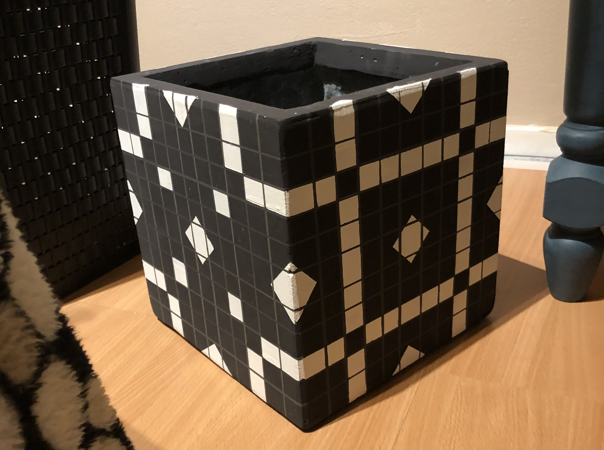

## Method

After I dragged the thrifted bedside tables to my home in two shifts I started sketching out what I wanted to paint on at least one of them. I knew it would be a persian style, but I had to figure out what type of figures and what/how they would fit on each surface of the table. I drew several concepts digitally and after that, true to size on paper. I stuck each individual piece on cardboard and used a stanley knife to cut out the shape, in order to make stencils. This made my life a lot easier once I started painting. For sharp, straight lines I used painters tape. It was very precise work, but very satisfying as well. It took me about 1 month to complete the persian table: I'd quickly work on it before I went to my internship and continue after I came back if I had the time. I'm still really happy with how it turnt out.

The other bedside table got a more abstract, simple design. This design was planned/drawn out using Adobe Illustrator. Because of its repetitive shapes, this was the easiest approach: I played around with the sizes until I was satisfied. After that, I repeated the process of creating stencils and sanding/painting/sealing in the same manner as the other table. The table was then sent to Belgium to a dear friend of mine, for her birthday.

My last project was a plant pot that I painted in a geometrical manner. It was a Secret Santa gift. As for future projects, none planned so far, but we will see what I stumble upon next!
