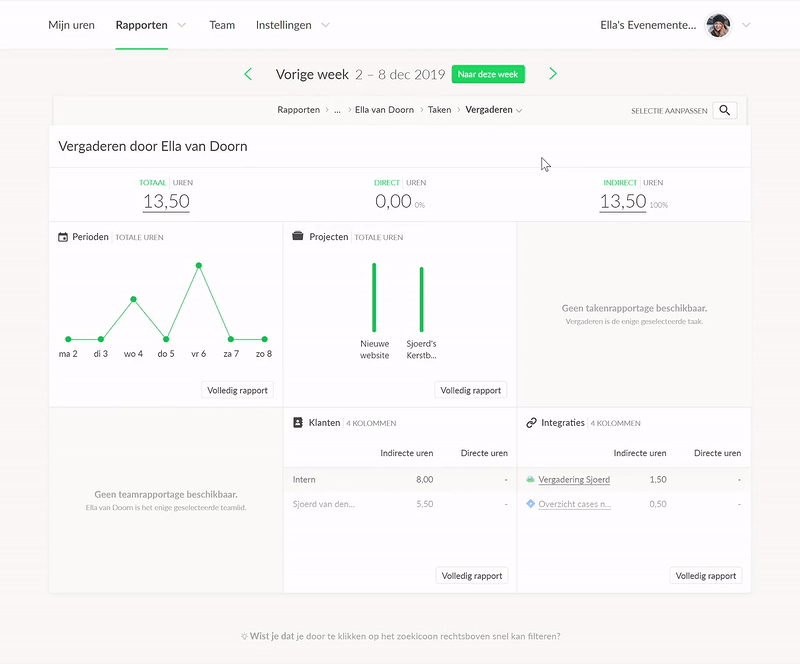

## Method

As a UX designer, I first wanted to define the problem space clearly. I was interested in how people navigated through the website and what their mental models looked like. I started writing down all my own observations and performed a small usability test (N=5) where users needed to perform three common tasks, using a thinking-aloud protocol. I also looked at applications of competitors and a previous Keeping questionnaire filled in by 101 users. Five goals were identified for the redesign:

- **Improving date management**: changing the time unit easily and going back and forth using this unit.

- **Improving consistency** of design elements and their placement.

- **Creating a clear overview**: the website used a tab-structure to go deeper into detail, but users lose track of how deep they are in the navigation and how tab combinations work together.

- **The possibility to filter quickly** instead of needing many clicks.

- **Adding meaningful visualisations**, whereas now everything is in text format.

After creating these goals, I began drawing low-fi prototypes, then creating more high-fi mock ups. Because I was working on a redesign, I had to study the current design language and make this my own. There were no documents that contained all design elements, so I created these for reference.

Improving date management was an important subgoal in improving the application. There were elements that were placed too far apart and confused users because they weren't grouped together, losing their meaning. Some arrows were also ambiguous on whether they meant going to a previous page or a previous time unit. To create more cohesion, we placed the date in the center of the page and moved the arrows closer around it. Hovering over the date now creates an underline, indicating that the date can be clicked on. This opens up a dropdown in which days, weeks, months, quartiles, years and custom dates can be selected with a few clicks. The image above displays several examples of its layout.

## Conclusion and future plans

At the end of the internship, fully clickable prototypes were tested by 20 users. Both versions were presented in mock-up form. The main finding was that the flow of the application was better understood for the redesign with the dashboard than the (then current) tab version. The System Usability Scale also improved with 75.6 against 69.1. For reference, 68 entails a just-above average score (50th percentile). A score of 75 means that the website scores better than 73% of all the thousands of websites that the scale is based on!

Please note that this post is only a small part of all the changes that were made for the redesign of Keeping. A blogpost can be found [here](https://keeping.nl/blog/09-12-2019-nieuwe-rapportage-functie) to read about all the changes in even more detail.

‍
