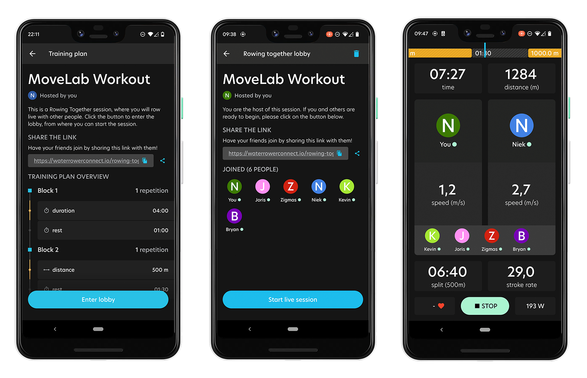

## Method

In the pictures above, you can see two screenshots of features that I've designed and implemented. I've created more, but am not able to share those since they are not available on the app store yet. These two are nice to highlight in any case.

When it comes to the social aspect of the app, we were lacking in social interactions. To make a start with this, I created a feature for users to share their workout results on social media; from image design to microcopy (text and hashtags) to implementation of it (front-end and back-end). I really like completing full processes such as this one. Working on all aspects gives me insight on what designers need to communicate to programmers for them to be able to implement a feature smoothly without questions/uncertainties.

As for a user's workout history, the app previously only contained a simple list, where all types of workouts (distance, time, interval) were formatted the same. It made it difficult to find back a certain workout. The page also wasn't very flexible or interesting. Therefore, I created a timeline of all past workouts and also included options to select a certain time period grouping and filter on the type of workout (distance, interval, time, etc). This way, the user is flexible in choosing what they want to see. Even more interesting are the percentages that the user can read from their timeline, showing them their progress period by period. Over time, we want to create even more insights for the user to compare and analyse their data.

In January 2022, the Premium version of WaterRower Connect was launched. One of its features was ''Rowing Together'', where Premium users can row the same workout at the same time. The idea is that a user can create an ‘’online’’ lobby that other users can join via a link. The lobby is connected to a workout that the host has created. When the host presses ‘’Start’’ in the lobby, this workout will start for all users. They are able to see each others’ live data, giving them the feeling of actually rowing together. We went through many iterations of the design for this feature. We wanted it to be informative on what the user was going to execute. We also wanted the flow to be logical and easy to navigate. Furthermore, we wanted to create a feeling for the user that they were doing the workout together. This feature is still being developed further. For example, we are going to add a chat functionality in the lobby, which will help users to connect and discuss details before starting the workout.

‍

## Conclusion and future plans

Many more designs have been created for the WaterRower Connect app, which unfortunately cannot be shared yet as this is confidential information. I’ll be updating this page once new cool features are released!

‍
