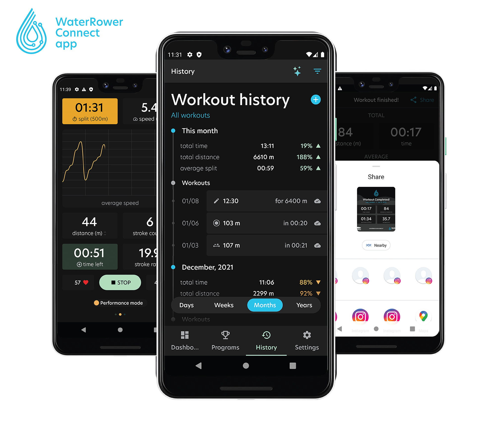

## Method

Programming at MoveLab taught me many things: patterns, dealing with server requests, clean coding. It also improved my objected oriented programming and reactive programming skills, and many many other things. I started coding Android apps in the beginning of 2020 and since then I have learnt a ton! My bachelor and master education prepared me to be able to learn any coding language (or at least have the faith that I can do so!) and Kotlin was no exception. But having to deal with lifecycles and activities and other Android specific things, brought on new challenges: I'm still learning every day as I'm typing this. It is super fulfilling to think up a feature, write a pitch for it (we use the ShapeUp method by Basecamp, previously Scrum was used) and execute it. It's rare that everything goes smooth from the get-go, but I think this is very much a part of programming.
